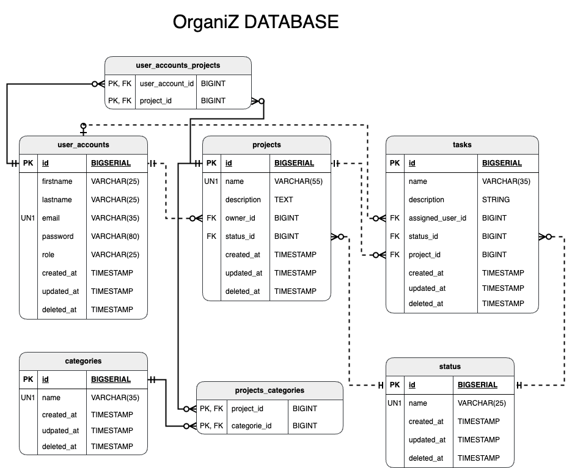

# Organiz Project
Organiz is a project management application that allows users to manage their projects, tasks, and categories efficiently. This README provides instructions on how to set up and run the application.


## Database Schema



## Prerequisites

Before starting, ensure you have the following installed:

- [Docker](https://www.docker.com/get-started)
- [Node.js](https://nodejs.org/) (v20 or later)
- [npm](https://www.npmjs.com/)

## Running the Application

### Option 1: Using Docker Compose (Recommended)

The easiest way to launch the application is with Docker Compose.

1. Clone the repository:
   ```bash
   git clone https://github.com/Pink0s/OrganiZ
   cd organiz
   ```

2. Start the application:
   ```bash
   docker compose up -d --build
   ```

3. Access the application:
   - Frontend: [http://localhost](http://localhost)
   - swagger API: [http://localhost/api/swagger](http://localhost/api/swagger)

That's it! The application is now running.

---

### Option 2: Running Manually

If you prefer to run the application manually, follow these steps:

#### Step 1: Prepare `.env` Files

You need to set up `.env` files for both the frontend and backend.

1. Edit the `.env` files and provide the required configuration:
   - For the backend (`organiz_api/.env`), include database and API URL.
   - For the frontend (`organiz_front/.env`), include the API URL for the backend.

---

#### Step 2: Install Dependencies and Start Services

1. Install dependencies and start the backend API:
   ```bash
   cd organiz_api
   npm install
   npm run dev
   ```

2. Open a new terminal and start the frontend:
   ```bash
   cd organiz_front
   npm install
   npm run dev
   ```

---

### Additional Notes

- To stop the application when using Docker Compose:
  ```bash
  docker compose down
  ```